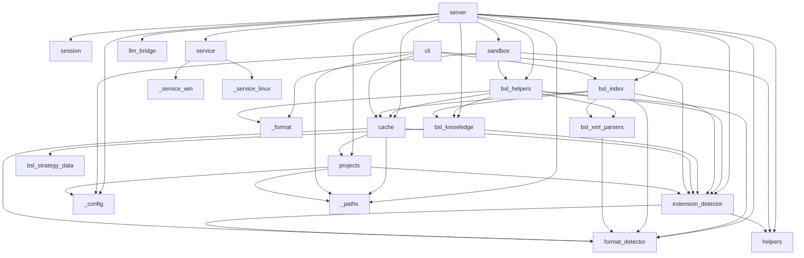

# Карта модулей

## Группы модулей

### Точки входа
- **`__init__.py`** — пакет, публичный API (`__version__`)
- **`__main__.py`** — `python -m rlm_tools_bsl` → запуск MCP-сервера
- **`cli.py`** — CLI `rlm-bsl-index` (build / update / info / drop) → `bsl_index`, `cache`, `extension_detector`, `_config`, `_paths`
- **`server.py`** — MCP-сервер. Базовый набор тулов: `rlm_projects`, `rlm_index`, `rlm_start`, `rlm_execute`, `rlm_end`. **+ `rlm_help` (v1.11.0)** — slim-mode компаньон к `rlm_start`; регистрируется условно в `@mcp.tool()`-блоке за `if get_strategy_mode() == 'slim':`, поэтому при `RLM_STRATEGY_MODE=full` тула нет ни в FastMCP манифесте, ни в namespace модуля. Диспетчер `_rlm_help_dispatch(...)` — 6 режимов с приоритетом сверху вниз (menu → topic → disambiguation → section → helpers → category) и `warnings: list[str]` при конфликтах аргументов; читает данные из `bsl_knowledge` (helper-функции `_get_*`, `list_topics/sections/categories`, `_fuzzy_suggest`) и `bsl_helpers.build_helper_metadata_snapshot()`. В info-логе `_rlm_start` поля `mode=slim/full` и `strategy_chars=N` (v1.11.0). → `session`, `sandbox`, `llm_bridge`, `format_detector`, `extension_detector`, `bsl_knowledge`, `bsl_index`, `cache`, `projects`, `service`, `helpers`, `bsl_helpers`, `_config`, `_paths`

### Сессии и песочница
- **`session.py`** — SessionManager, двухуровневый TTL (idle/active), `build_session_manager_from_env()` → _(нет внутренних зависимостей)_
- **`sandbox.py`** — Sandbox (exec Python в изолированном окружении с хелперами); session-wide anti-duplicate detection в `_wrap_helpers` (v1.10.0); сообщения-подсказки `_add_error_hints` для типичных ошибок (KeyError на контракте `get_object_full_structure`, FileNotFoundError для parse_object_xml/read_procedure, TimeoutError, NameError, restricted import) → `helpers`, `bsl_helpers`, `_format`

### BSL-логика
- **`bsl_helpers.py`** — 45 хелпер-функций для анализа BSL/1С (регистрируются через `_reg()`). **`build_helper_metadata_snapshot()` (v1.11.0)** — module-level lazy + thread-safe срез реестра `{name: {sig, cat, kw, recipe}}` без активной сессии (через stub-callbacks `make_bsl_helpers`); используется dispatcher'ом `rlm_help` в `server.py`. Из v1.10.0: агрегатор `get_object_full_structure(name)` (1 вызов вместо 3-5 — заменяет parse_object_xml + find_attributes + find_predefined + find_enum_values; `_meta.index_used`/`fallback_reason`/`ts_synonyms_available`); `find_call_hierarchy(name, direction='callers', depth=1..3)` — multi-level callers tree через `idx_calls_callee`; `find_register_movements` отдаёт `is_postable: False` + hint при `Posting=Deny`; `find_event_subscriptions` поддерживает `event_filter` (list[str] или строка — нормализуется) и `limit` (paginated dict); `find_based_on_documents` lazy back_scan через ObjectModule других Documents; `analyze_document_flow` обогащён `based_on`/`print_forms` + top-level `is_postable`/`hint`; `_resolve_object_xml` нормализует «фейковые» .mdo/.xml пути. Sandbox-хелпер `bsl_help(task)` (внутри песочницы как `help('keyword')`) — двухпроходная стратегия (exact kw → substring) + bridge на `_BUSINESS_RECIPES`/`_match_recipe`; **доступен в обоих режимах стратегии (full и slim)** — отдельный канал code-time-справки, не путать с MCP-тулом `rlm_help`. Из v1.9.0: `find_references_to_object`, `find_defined_types`. → `format_detector`, `bsl_knowledge`, `cache`, `bsl_xml_parsers`, `extension_detector`, `_format`
- **`bsl_knowledge.py`** — стратегия анализа. **Router `get_strategy(...)` (v1.11.0)** — диспетчер по `RLM_STRATEGY_MODE` (`slim` default, `full` legacy fallback, невалидное значение → `slim`); делегирует в `_build_slim_strategy(...)` или `_build_full_strategy(...)` (старая реализация под новым именем — без изменений тела). `_build_slim_strategy(...)` собирает компактную маршрутную карту (~3900 chars vs ~13500 chars в full): preamble + `STRATEGY_SECTIONS["critical"]` + `_SLIM_HELP_BLOCK` (указатель на `rlm_help`) + `_SLIM_WORKFLOW_OVERVIEW` + auto-routed compact recipe (всегда compact, full + code_hint доступны через `rlm_help(topic=..., format='full')`) + `build_slim_helpers_index(registry)` (имена по категориям, без сигнатур) + `_SLIM_DISAMBIGUATION_POINTER` + `STRATEGY_SECTIONS["batching"]` + `_render_index_block(...)` + effort/format/prefixes. Render-helpers `_render_index_block`, `build_slim_helpers_index`. **Dispatcher-хелперы для `rlm_help`** (используются из `server.py`): `_get_section`, `_get_disambiguation`, `_get_category_helpers`, `_get_topic_recipe`, `_get_helper_details`, `_fuzzy_suggest`, `list_topics/list_sections/list_categories`, `get_strategy_mode`. **12 бизнес-рецептов** (себестоимость, проведение, распределение, печать, права, интеграция, события формы, ссылки, тип реквизита, перечисления, ввод на основании, структура объекта); 44 алиаса; **DISAMBIGUATION-секция** в `_STRATEGY_HEADER` (9 пар + дополнительные правила) для full-режима; для slim → `DISAMBIGUATION_PAIRS` в `bsl_strategy_data.py`; WORKFLOW, INDEX TIPS, Step 4 ANALYZE INSTANT/HYBRID/LIVE. → `bsl_strategy_data`, `extension_detector`
- **`bsl_strategy_data.py`** (v1.11.0) — leaf-модуль (только stdlib): `STRATEGY_SECTIONS` (5 ключей: `critical`, `workflow`, `performance`, `batching`, `io` — текстовые секции для `rlm_help(section=...)`) + `DISAMBIGUATION_PAIRS` (8 структурированных пар `{pair, summary, when_a, when_b, rule, tags}` для `rlm_help(section='disambiguation')`). Намеренно **не импортирует** `bsl_knowledge` или `bsl_helpers` — нет циркулярки. → _(нет внутренних зависимостей)_
- **`bsl_index.py`** — SQLite-индекс v12 (26 таблиц + FTS5: core×4, metadata×17, navigation×1, references×4 — `metadata_references`, `exchange_plan_content`, `defined_types`, `characteristic_types`), IndexBuilder, IndexReader, **git fast path с pointwise incremental refresh** (v1.9.3: per-object DELETE+INSERT для Catalogs/Documents/IRегистры/AРегистры/АOрегистры/CoA/EventSubscriptions/ScheduledJobs/XDTOPackages вместо category-wide rescan; soft thresholds + bulk fallback для остального); защита от битых XML в `parse_metadata_xml` (try/except в 3 callsites, v1.10.0 BUG-3); `IndexReader.get_event_subscriptions(event_filter=...)` нормализует строку в `[строка]` (v1.10.0 BUG-8). BUILDER_VERSION=12 (без изменений с v1.9.x) → `bsl_knowledge`, `cache`, `format_detector`, `bsl_xml_parsers`, `extension_detector`
- **`bsl_xml_parsers.py`** — парсеры XML-метаданных 1С (CF и EDT форматы): `parse_metadata_xml` (с полем `references` для reverse-index), `canonicalize_type_ref`, `parse_defined_type`, `parse_pvh_characteristics`, `parse_command_parameter_type`, `parse_event_subscription_xml`, `parse_scheduled_job_xml`, `parse_xdto_package_xml` → `format_detector`

### Детектирование формата
- **`format_detector.py`** — определение CF/EDT, парсинг путей BSL-файлов (`parse_bsl_path`, `METADATA_CATEGORIES`) → _(нет внутренних зависимостей)_
- **`extension_detector.py`** — обнаружение расширений 1С и переопределений методов → `format_detector`, `helpers`

### Инфраструктура
- **`helpers.py`** — общие утилиты (smart_truncate, normalize_path, format_table) → _(нет внутренних зависимостей)_
- **`cache.py`** — дисковый кеш BSL-файлов (root зависит от `RLM_INDEX_DIR`/`RLM_CONFIG_FILE`/`~/.cache`, см. `docs/INDEXING.md`) → `format_detector`, `extension_detector`, `projects`, `_paths`
- **`llm_bridge.py`** — OpenAI-совместимый LLM-клиент (батчинг, retry) → _(нет внутренних зависимостей)_
- **`projects.py`** — реестр проектов (name → path, `projects.json`) → `_config`, `extension_detector`, `_paths`
- **`_config.py`** — загрузка конфигурации, поиск `.env` и `service.json` → _(нет внутренних зависимостей)_
- **`_format.py`** — форматирование вывода (presentation layer) → _(нет внутренних зависимостей)_
- **`_paths.py`** — общая каноникализация файловых путей (используется `server.py`, `projects.py`, `cache.py`, `cli.py`) → _(нет внутренних зависимостей)_

### Сервис
- **`service.py`** — управление сервисом (install / start / stop / status) → `_service_win` (Windows), `_service_linux` (Linux)
- **`_service_win.py`** — реализация Windows-сервиса через pywin32 → `service`
- **`_service_linux.py`** — реализация Linux systemd `--user` юнита → `service`

## Граф зависимостей

## Синхронизация текста стратегии между двумя режимами

С v1.11.0 текст стратегии живёт в **двух источниках**: `_STRATEGY_HEADER` / `_STRATEGY_IO_SECTION` в `bsl_knowledge.py` обслуживают `RLM_STRATEGY_MODE=full` (полный inline-текст), а `STRATEGY_SECTIONS` + `DISAMBIGUATION_PAIRS` в `bsl_strategy_data.py` — slim-режим (через MCP-tool `rlm_help(section=...)`). Объединять их в один источник истины пробовали — упирается либо в reorder Step 5 (ломает байт-в-байт legacy), либо в потерю одиночных правил DISAMBIGUATION при рендере из 8 структурированных пар; решили оставить дублирование с тестом-tripwire.

**Что синхронить при правке текста:**

| Что меняешь | Место для full-режима | Место для slim (`rlm_help`) |
|---|---|---|
| Текст `Step 0..5` (WORKFLOW) | `_STRATEGY_HEADER` (внутри блока `== WORKFLOW ==`) | `STRATEGY_SECTIONS["workflow"]` |
| Блок `STEP 4 EXTENDED` (INSTANT/HYBRID/LIVE) | `_STRATEGY_HEADER` (внутри блока `== STEP 4 EXTENDED ==`) | `STRATEGY_SECTIONS["performance"]` |
| Блок `BATCHING & OUTPUT` | `_STRATEGY_HEADER` (внутри блока `== BATCHING & OUTPUT ==`) | `STRATEGY_SECTIONS["batching"]` |
| Блок `CRITICAL` | `_STRATEGY_HEADER` (внутри блока `== CRITICAL ==`) | `STRATEGY_SECTIONS["critical"]` |
| Блок `File I/O` + LLM | `_STRATEGY_IO_SECTION` | `STRATEGY_SECTIONS["io"]` |
| Правила `== DISAMBIGUATION ==` (текст) | `_STRATEGY_HEADER` (внутри блока `== DISAMBIGUATION ==`) | `DISAMBIGUATION_PAIRS` (структурированный список `{pair, summary, when_a, when_b, rule, tags}`) |

**Что синхронить НЕ нужно** (живёт в одном месте, оба режима читают через общий API):
- бизнес-рецепты — `_BUSINESS_RECIPES` в `bsl_knowledge.py`;
- алиасы доменов — `_RECIPE_ALIASES`;
- хелперы и их per-helper recipes — `_reg(name, fn, sig, cat, kw, recipe)` в `bsl_helpers.py`;
- категории — `_CATEGORY_ORDER`.

**Защита от забытого синка** — `tests/test_strategy_data.py::test_strategy_sections_did_not_drift_from_legacy`: проверяет что в обоих копиях есть маркеры `== CRITICAL ==`, `Step 0 — UNDERSTAND`, `== STEP 4 EXTENDED`, `== BATCHING & OUTPUT ==`, `File I/O:`. Подменишь блок целиком — заметит; переформулируешь строку внутри — пропустит. Также `tests/test_strategy_mode_env.py::test_router_full_matches_legacy_builder` гарантирует что router-обёртка `get_strategy(...)` под `RLM_STRATEGY_MODE=full` идентична прямому вызову `_build_full_strategy(...)`.

**Что нужно при добавлении пары DISAMBIGUATION:** обновить счётчик `assert len(DISAMBIGUATION_PAIRS) == 8` в `tests/test_strategy_data.py::test_disambiguation_pairs_count`.

**Что нужно при добавлении бизнес-домена / категории хелпера:** обновить enum в `Field(description=...)` параметра `topic`/`category` в `rlm_help` ([server.py](../src/rlm_tools_bsl/server.py)) — это документация для агента. Сами значения берутся из `_BUSINESS_RECIPES` / `_CATEGORY_ORDER` динамически.
