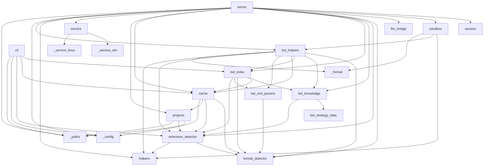

# Карта модулей

## Группы модулей

### Точки входа
- **`__init__.py`** — пакет, публичный API (`__version__`)
- **`__main__.py`** — `python -m rlm_tools_bsl` → запуск MCP-сервера
- **`cli.py`** — CLI `rlm-bsl-index` (build / update / info / drop) → `bsl_index`, `cache`, `extension_detector`, `_config`, `_paths`
- **`server.py`** — MCP-сервер. Базовый набор тулов: `rlm_projects`, `rlm_index`, `rlm_start`, `rlm_execute`, `rlm_end`. **+ `rlm_help` (v1.11.0)** — slim-mode компаньон к `rlm_start`; регистрируется условно в `@mcp.tool()`-блоке за `if get_strategy_mode() == 'slim':`, поэтому при `RLM_STRATEGY_MODE=full` тула нет ни в FastMCP манифесте, ни в namespace модуля. Диспетчер `_rlm_help_dispatch(...)` — 6 режимов с приоритетом сверху вниз (menu → topic → disambiguation → section → helpers → category) и `warnings: list[str]` при конфликтах аргументов; читает данные из `bsl_knowledge` (helper-функции `_get_*`, `list_topics/sections/categories`, `_fuzzy_suggest`) и `bsl_helpers.build_helper_metadata_snapshot()`. В info-логе `_rlm_start` поля `mode=slim/full` и `strategy_chars=N` (v1.11.0). → `session`, `sandbox`, `llm_bridge`, `format_detector`, `extension_detector`, `bsl_knowledge`, `bsl_index`, `cache`, `projects`, `service`, `helpers`, `bsl_helpers`, `_config`, `_paths`

### Сессии и песочница
- **`session.py`** — SessionManager, двухуровневый TTL (idle/active), `build_session_manager_from_env()` → _(нет внутренних зависимостей)_
- **`sandbox.py`** — Sandbox (exec Python в изолированном окружении с хелперами); session-wide anti-duplicate detection в `_wrap_helpers` (v1.10.0); сообщения-подсказки `_add_error_hints` для типичных ошибок (KeyError на контракте `get_object_full_structure`, FileNotFoundError для parse_object_xml/read_procedure, TimeoutError, NameError, restricted import). **`extension_paths` kwarg (v1.12.0)** — список абсолютных путей соседних расширений; передаётся ТОЛЬКО в `make_bsl_helpers(extension_paths=...)`, generic `make_helpers(...)` остаётся base-only (sandbox-инвариант для `read_file`/`grep`/`glob_files` сохранён). Наполняется из `server._rlm_start` только когда `ext_context.current.role == ConfigRole.MAIN` (для extension-сессий передаётся `[]` — base = само расширение). → `helpers`, `bsl_helpers`, `_format`

### BSL-логика
- **`bsl_helpers.py`** — 51 хелпер-функция для анализа BSL/1С (регистрируются через `_reg()`). **Граф потока управления (v1.19.0)**: `find_call_hierarchy(..., include_triggers=False)` — opt-in аннотация `triggers` на узлах (не-call рёбра из `IndexReader.get_inbound_edges`, дефолт байт-в-байт прежний); `find_path(from, to, max_depth=4, from_hint, to_hint, include_triggers)` (cat `code`) — достижимость по графу ВЫЗОВОВ через индексный реверс-BFS callers, `_meta.precision` exact/heuristic, `call_line` = строка ребра к следующему узлу; `find_data_path(from, to, max_depth=4, kinds)` (cat `navigation`) — N-hop BFS по `metadata_references` (outbound через `IndexReader.find_metadata_refs_from`), endpoints с префиксом, отдельный node-budget (`_DATA_PATH_NODE_BUDGET=400`). Импорт `_make_callee_key` из `bsl_index` на уровне модуля (общий ключ build/query). 2 домена `rlm_help`: `достижимость`/`путь данных`. **`build_helper_metadata_snapshot()` (v1.11.0)** — module-level lazy + thread-safe срез реестра `{name: {sig, cat, kw, recipe}}` без активной сессии (через stub-callbacks `make_bsl_helpers`); используется dispatcher'ом `rlm_help` в `server.py`. **`extension_paths` kwarg + extension visibility (v1.12.0)** — `make_bsl_helpers(extension_paths=[...])` принимает корни соседних расширений. Внутри замыкания: `_ext_resolve_safe(path)` — multi-root резолвер (`base + *extension_paths`, raises `PermissionError` при выходе из всех roots); `_ext_read_file(path)` — читатель с делегированием в sandbox cache для base-файлов и собственным OrderedDict-кэшем (≤200 entries) для extension-файлов. `_ensure_index` рефакторен на `_load_main_into_index_state()` + `_load_extensions_into_index_state()` (extension pass ВСЕГДА после main — критично для idx_reader-сессий, иначе extension-модули невидимы). Side-структуры: `_extension_paths_set` (rel-пути), `_extension_root_for` (rel → абс. root), `_extension_metadata_xml` (locator для ВСЕХ XML/MDO ext-объектов вкл. без synonym — DRY с indexer'ом через общий `bsl_index._iter_metadata_xml_files`), `_extension_synonyms` (синонимы с RU-prefix для search_objects parity). High-level хелперы (`find_module`/`find_by_type`/`find_attributes`/`find_predefined`/`parse_object_xml`/`_parse_procedures`/`read_procedure`/`extract_procedures`/`search_*`) видят extension объекты и модули; пути возвращаются с префиксом `../cfe/...`. `_resolve_object_xml` теперь вызывает `_ensure_index()` и raises `PermissionError` если ни один кандидат не резолвится в `base + *extension_paths`. `find_attributes`/`find_predefined` auto-resolve через `_resolve_object_name_from_extension_metadata(object_name)` — возвращает CANONICAL `(cat, "Category/Name")` из metadata-entry (защита от case-mismatch). Generic-хелперы (`read_file`/`grep`/`glob_files`) НЕ затронуты — sandbox base-only invariant сохранён. **Multi-line процедуры (v1.12.0)**: `_parse_procedures` склеивает многострочные сигнатуры через общий `bsl_knowledge._merge_proc_continuations` (hard-cap 20 строк / 2000 символов, string-literal-aware); `extract_procedures` делает opportunistic live-fill для индексированных путей (добавляет процедуры, которых не было в `idx_reader.get_methods_by_path(path)`, с применением того же `overrides_map` через `_attach_overrides` — self-healing без `rlm-bsl-index index update`). **search_\* live-fallback (v1.12.0)**: `_live_search_methods`/`_live_search_objects`/`_live_search_regions`/`_live_search_module_headers` дополняют индексные результаты данными из расширений; shape результата строго зеркалит `IndexReader` (`rank=None` для методов, `Категория: Синоним` prefix для объектов); дедуп по `(module_path, name)` / `(file, object_name)`. Из v1.10.0: агрегатор `get_object_full_structure(name)` (1 вызов вместо 3-5 — заменяет parse_object_xml + find_attributes + find_predefined + find_enum_values; `_meta.index_used`/`fallback_reason`/`ts_synonyms_available`); `find_call_hierarchy(name, direction='callers', depth=1..3, module_hint='')` — multi-level callers tree (**v1.16.0**: exact-режим по `module_hint` с cycle-protection visited-by-target, поля доверия `_meta.root_exact`/`exact_rows`/`fallback_rows`/`node_budget_exceeded`; node-budget backstop `_HIERARCHY_VISITED_CAP=2000` от взрыва обхода на широком корне без hint); `find_register_movements` отдаёт `is_postable: False` + hint при `Posting=Deny`; `find_event_subscriptions` поддерживает `event_filter` (list[str] или строка — нормализуется) и `limit` (paginated dict); `find_based_on_documents` lazy back_scan через ObjectModule других Documents; `analyze_document_flow` обогащён `based_on`/`print_forms` + top-level `is_postable`/`hint`; `_resolve_object_xml` нормализует «фейковые» .mdo/.xml пути. Sandbox-хелпер `bsl_help(task)` (внутри песочницы как `help('keyword')`) — двухпроходная стратегия (exact kw → substring) + bridge на `_BUSINESS_RECIPES`/`_match_recipe`; **доступен в обоих режимах стратегии (full и slim)** — отдельный канал code-time-справки, не путать с MCP-тулом `rlm_help`. Из v1.9.0: `find_references_to_object`, `find_defined_types`. → `format_detector`, `bsl_knowledge`, `bsl_index` (lazy import `_collect_object_synonyms`, `_iter_metadata_xml_files` в extension pass), `cache`, `bsl_xml_parsers`, `extension_detector`, `helpers` (`_SKIP_DIRS` для extension os.walk), `_format`
- **`bsl_knowledge.py`** — стратегия анализа. **Router `get_strategy(...)` (v1.11.0)** — диспетчер по `RLM_STRATEGY_MODE` (`slim` default, `full` legacy fallback, невалидное значение → `slim`); делегирует в `_build_slim_strategy(...)` или `_build_full_strategy(...)` (старая реализация под новым именем; общий блок `_extension_strategy` token-bounded в обоих режимах — счётчики overrides + on-demand, детализация через `RLM_EXT_OVERRIDE_DETAIL`). **Top-N кэп списка расширений (`RLM_EXT_LIST_CAP`, дефолт 20)**: на extreme-extension конфигах (напр. 155 расш) `summarize_extensions_by_overrides(nearby_extensions, ext_overrides, cap) -> (shown_list, total, n_shown)` (рядом с `_format_overrides_summary`) усекает агент-facing представления до top-N по overrides с детерминированным тай-брейком `(-overrides, name, prefix, normcase(path))`; при `N≤cap` или `cap<=0` — full байт-в-байт. Зовётся из 3 мест (все режут ТОЛЬКО ветку MAIN): `extension_detector._build_warnings` (короткая сводка + `_ext_list_cap()`), `_extension_strategy` (заголовок top-N + строка `+K more` + сводка по скрытым), `server._rlm_start` (поле `nearby_extensions` + companion `nearby_extensions_truncated`/`_total`/`_shown`/`extensions_hint`). Внутренний `ext_context.nearby_extensions` и `ext_paths_for_sandbox` НЕ трогаются. `_build_slim_strategy(...)` собирает компактную маршрутную карту (~3900 chars vs ~13500 chars в full): preamble + `STRATEGY_SECTIONS["critical"]` + `_SLIM_HELP_BLOCK` (указатель на `rlm_help`) + `_SLIM_WORKFLOW_OVERVIEW` + auto-routed compact recipe (всегда compact, full + code_hint доступны через `rlm_help(topic=..., format='full')`) + `build_slim_helpers_index(registry)` (имена по категориям, без сигнатур) + `_SLIM_DISAMBIGUATION_POINTER` + `STRATEGY_SECTIONS["batching"]` + `_render_index_block(...)` + effort/format/prefixes. Render-helpers `_render_index_block`, `build_slim_helpers_index`. **Dispatcher-хелперы для `rlm_help`** (используются из `server.py`): `_get_section`, `_get_disambiguation`, `_get_category_helpers`, `_get_topic_recipe`, `_get_helper_details`, `_fuzzy_suggest`, `list_topics/list_sections/list_categories`, `get_strategy_mode`. **12 бизнес-рецептов** (себестоимость, проведение, распределение, печать, права, интеграция, события формы, ссылки, тип реквизита, перечисления, ввод на основании, структура объекта, расширения); 44+ алиасов; **DISAMBIGUATION-секция** в `_STRATEGY_HEADER` (9 пар + дополнительные правила) для full-режима; для slim → `DISAMBIGUATION_PAIRS` в `bsl_strategy_data.py`; WORKFLOW, INDEX TIPS, Step 4 ANALYZE INSTANT/HYBRID/LIVE. **Step 5 EXTENSIONS (v1.12.0)** — обновлён синхронно в slim (`STRATEGY_SECTIONS["workflow"]`) + full (`_STRATEGY_HEADER`) + динамическом `_extension_strategy` (CRITICAL EXTENSIONS DETECTED блок) + рецепт `расширения` в `_BUSINESS_RECIPES`: пути с `../` принимаются high-level хелперами (`read_procedure`, `extract_procedures`, `parse_object_xml`, `find_attributes`, `find_predefined`, `search`), но запрещены для `read_file`/`grep`/`glob_files` (PermissionError). **`_merge_proc_continuations(lines) -> (merged_lines, line_map)` (v1.12.0)** — общий util для multi-line BSL-сигнатур (string-literal-aware баланс скобок, hard-cap 20 строк / 2000 символов); используется и в `bsl_index._parse_procedures_from_lines`, и в `bsl_helpers._parse_procedures`. → `bsl_strategy_data`, `extension_detector`
- **`bsl_strategy_data.py`** (v1.11.0) — leaf-модуль (только stdlib): `STRATEGY_SECTIONS` (5 ключей: `critical`, `workflow`, `performance`, `batching`, `io` — текстовые секции для `rlm_help(section=...)`) + `DISAMBIGUATION_PAIRS` (9 структурированных пар `{pair, summary, when_a, when_b, rule, tags}` для `rlm_help(section='disambiguation')`). Намеренно **не импортирует** `bsl_knowledge` или `bsl_helpers` — нет циркулярки. → _(нет внутренних зависимостей)_
- **`bsl_index.py`** — SQLite-индекс v14 (27 таблиц + FTS5: core×4, metadata×17, navigation×1, references×4 — `metadata_references`, `exchange_plan_content`, `defined_types`, `characteristic_types` — + code-usages×1 `metadata_code_usages`), IndexBuilder, IndexReader, **git fast path с pointwise incremental refresh** (v1.9.3: per-object DELETE+INSERT для Catalogs/Documents/IRегистры/AРегистры/АOрегистры/CoA/EventSubscriptions/ScheduledJobs/XDTOPackages вместо category-wide rescan; soft thresholds + bulk fallback для остального); защита от битых XML в `parse_metadata_xml` (try/except в 3 callsites, v1.10.0 BUG-3); `IndexReader.get_event_subscriptions(event_filter=...)` нормализует строку в `[строка]` (v1.10.0 BUG-8). **`_iter_metadata_xml_files(base_path, categories=None) -> list[(cat, obj_name, rel_xml)]` (v1.12.0)** — выделен из `_collect_object_synonyms` общий path-scan по `_SYNONYM_CATEGORIES` без парсинга XML и фильтра по synonym (CF `Cat/Obj/Ext/<Type>.xml` → CF sibling `Cat/Obj.xml` → CF sibling-only `Cat/<Name>.xml` для EventSubscriptions → EDT `Cat/Obj/Obj.mdo` → Subsystems recursive). `_collect_object_synonyms` использует тот же helper + concurrent XML-parse → DRY-инвариант: indexer и bsl_helpers extension pass видят один и тот же set rel_paths. **Multi-line парсер (v1.12.0)**: `_parse_procedures_from_lines` пропускает входной список через общий `bsl_knowledge._merge_proc_continuations`; `end_line` берётся из ОРИГИНАЛЬНОГО списка строк (КонецПроцедуры всегда на отдельной строке). **`metadata_code_usages` (Level-13, v1.14.0)** — обратный индекс использований объектов МД В КОДЕ (код-производная таблица, как `regions`/`module_headers`): `_extract_code_usages(lines)` в общем проходе `_process_single_file` (manager/ref_type/query, источник-aware), `object_ref_key=object_ref.lower()` для indexed Cyrillic-aware lookup без UDF, инкремент чанкованным `DELETE ... WHERE module_id IN (...)`. BUILDER_VERSION=13 (bump с 12 → разовый force-rebuild на старых индексах, как при добавлении regions в v8). **Call-graph resolution + Phase A/B (v1.16.0, BUILDER_VERSION=14)** — (A) извлечение вызовов `_extract_calls_from_body` переведено с построчного `_strip_code_line` на многострочный `_scan_module`, поэтому функции языка запросов из многострочных строковых литералов (`ЕСТЬNULL(`/`ЗНАЧЕНИЕ(`/`СУММА(`) больше **не** дают ложных рёбер; (B) каждое ребро резолвится в стабильный текстовый ключ цели `callee_key="<rel_path>::<casefold(метод)>"` (nullable-колонка `calls.callee_key` + `idx_calls_callee_key`; общий `_make_callee_key` для build/query) по двум tier'ам — **local** (голое `B()` → метод модуля вызывающего) и **common_exported** (`A.B()` → экспортный метод общего модуля); object/manager/платформенные/неоднозначные → `NULL` by design. `IndexReader.get_callers` + `find_call_hierarchy` получили **exact-режим**: `_resolve_target_key(proc, module_hint)` (формы hint rel_path/`Документ.X`/bare через `_normalize_module_hint`) + `_meta.exact_rows`/`fallback_rows`/`target_exact`/`exact_available`. Агрегаты `_refresh_call_resolution_stats` → `index_meta.calls_total`/`calls_resolved`. **Перф** (релиз-добор): матч по имени сведён с leading-wildcard `LIKE '%.имя'` (full scan) на равенство по выражению-индексу `idx_calls_callee_short` (единый источник `_callee_short_expr` + `_callee_match_clause`: голое имя → суффикс-индекс, ввод с точкой → полный `callee_name` по `idx_calls_callee`); FK-индекс `idx_meth_module` ускоряет `_resolve_target_key` (modules→methods `SEARCH` вместо `SCAN`); проверка пустоты `calls` в `get_callers`/`has_calls` через `SELECT 1 LIMIT 1` вместо `COUNT(*)`. Оба перф-индекса — в `_SCHEMA_SQL` (build-путь, обе executescript-ветки) + безусловный self-heal `_ensure_callee_short_index`/`_ensure_meth_module_index` в `_update_locked` (вне `if bsl_changed:`). BUILDER_VERSION=14 (bump с 13 → разовый force-rebuild). **Read-only ридеры графа потока управления (v1.19.0, БЕЗ бампа версии/схемы)**: `get_inbound_edges(proc, module_hint)` — не-call inbound рёбра из 4 источников (`event_subscriptions`/`scheduled_jobs` форвард-JOIN по `CommonModules`, `form_elements` `kind='handler'` реверс через `is_form` модуль, `extension_overrides` CFE реверс скан малой таблицы) в общем пространстве `callee_key`; контракт `list[dict]` (никогда None), `resolved` exact/recall, кириллица через Python `.casefold()` (не `COLLATE NOCASE`); `resolve_target_identity(proc, module_hint)` — публичная **locked**-обёртка над lockless `_resolve_target_key` (lock = `threading.Lock`, не RLock); `find_metadata_refs_from(source_object, source_category, kinds, limit)` — outbound-зеркало `find_metadata_references` (`py_lower`-скан, `source_object` хранится bare, `ref_object` canonical). Аддитивное поле `edge_exact` в caller-rows `get_callers` (per-edge признак для `precision` в `find_path`). **Консистентность + перф инкремента (v1.21.0, БЕЗ бампа версии/схемы)**: модульный `_build_common_exported(conn)` (SQL-фильтр экспортных методов общих модулей — единый источник qualified-резолва для build/increment/re-resolve); `_bulk_insert` строит `methods_by_module`/`local_lookup` узким `WHERE module_id IN (batch из results)` по `idx_meth_module` при малом батче (порог 900, `ORDER BY module_id, line` сохранён), полный скан только на крупном/full build — лукапы 1-файлового инкремента ~300× быстрее на крупных базах; `_reresolve_qualified_callers(conn, changed_common_cf|None)` пере-резолвит qualified-рёбра нетронутых вызывателей при изменении общего модуля (per-delta — оба пути `update` собирают casefold-имена дельты: новые из `results`, старые из БД до DELETE; глобально при `None`) → строгий `update ≡ build` по `callee_key`; `_reresolve_qualified_callers_once` — одноразовая глобальная миграция legacy-дрейфа по флагу `index_meta.qualified_callers_reresolved` (рядом с `_purge_call_noise_once`, на любом `update` вкл. no-op; `_ensure_callee_key_column` для самодостаточности), флаг ставится и в `_write_meta` для свежего build. → `bsl_knowledge` (BSL_PATTERNS + `_merge_proc_continuations`), `cache`, `format_detector`, `bsl_xml_parsers` (`_RU_META_FORMS` + derived maps, `canonicalize_type_ref`), `extension_detector`
- **`bsl_xml_parsers.py`** — парсеры XML-метаданных 1С (CF и EDT форматы): `parse_metadata_xml` (с полем `references` для reverse-index), `canonicalize_type_ref`, `parse_defined_type`, `parse_pvh_characteristics`, `parse_command_parameter_type`, `parse_event_subscription_xml`, `parse_scheduled_job_xml`, `parse_xdto_package_xml`. **`_RU_META_FORMS` (v1.14.0)** — единый источник RU/EN форм метаданных (singular/plural/reftypes) для code-usage экстрактора `bsl_index`; производные карты `_CODE_MANAGER_COLLECTIONS`/`_CODE_QUERY_COLLECTIONS`/`_RU_REFTYPE_TO_CANONICAL` (leaf-модуль → импортируется и в `bsl_index`, и в `bsl_helpers` без циклов) → `format_detector`

### Детектирование формата
- **`format_detector.py`** — определение CF/EDT, парсинг путей BSL-файлов (`parse_bsl_path`, `METADATA_CATEGORIES`) → _(нет внутренних зависимостей)_
- **`extension_detector.py`** — обнаружение расширений 1С и переопределений методов → `format_detector`, `helpers`

### Инфраструктура
- **`helpers.py`** — общие утилиты (smart_truncate, normalize_path, format_table) → _(нет внутренних зависимостей)_
- **`cache.py`** — дисковый кеш BSL-файлов (root зависит от `RLM_INDEX_DIR`/`RLM_CONFIG_FILE`/`~/.cache`, см. `docs/INDEXING.md`) → `format_detector`, `extension_detector`, `projects`, `_paths`
- **`llm_bridge.py`** — OpenAI-совместимый LLM-клиент (батчинг, retry) → _(нет внутренних зависимостей)_
- **`projects.py`** — реестр проектов (name → path, `projects.json`) → `_config`, `extension_detector`, `_paths`
- **`_config.py`** — загрузка конфигурации, поиск `.env` и `service.json` → _(нет внутренних зависимостей)_
- **`_format.py`** — форматирование вывода (presentation layer) → _(нет внутренних зависимостей)_
- **`_paths.py`** — общая каноникализация файловых путей (используется `server.py`, `projects.py`, `cache.py`, `cli.py`) → _(нет внутренних зависимостей)_

### Сервис
- **`service.py`** — управление сервисом (install / start / stop / status) → `_service_win` (Windows), `_service_linux` (Linux)
- **`_service_win.py`** — реализация Windows-сервиса через pywin32 → `service`
- **`_service_linux.py`** — реализация Linux systemd `--user` юнита → `service`

## Граф зависимостей

## Синхронизация текста стратегии между двумя режимами

С v1.11.0 текст стратегии живёт в **двух источниках**: `_STRATEGY_HEADER` / `_STRATEGY_IO_SECTION` в `bsl_knowledge.py` обслуживают `RLM_STRATEGY_MODE=full` (полный inline-текст), а `STRATEGY_SECTIONS` + `DISAMBIGUATION_PAIRS` в `bsl_strategy_data.py` — slim-режим (через MCP-tool `rlm_help(section=...)`). Объединять их в один источник истины пробовали — упирается либо в reorder Step 5 (ломает байт-в-байт legacy), либо в потерю одиночных правил DISAMBIGUATION при рендере из 8 структурированных пар; решили оставить дублирование с тестом-tripwire.

**Что синхронить при правке текста:**

| Что меняешь | Место для full-режима | Место для slim (`rlm_help`) |
|---|---|---|
| Текст `Step 0..5` (WORKFLOW) | `_STRATEGY_HEADER` (внутри блока `== WORKFLOW ==`) | `STRATEGY_SECTIONS["workflow"]` |
| Блок `STEP 4 EXTENDED` (INSTANT/HYBRID/LIVE) | `_STRATEGY_HEADER` (внутри блока `== STEP 4 EXTENDED ==`) | `STRATEGY_SECTIONS["performance"]` |
| Блок `BATCHING & OUTPUT` | `_STRATEGY_HEADER` (внутри блока `== BATCHING & OUTPUT ==`) | `STRATEGY_SECTIONS["batching"]` |
| Блок `CRITICAL` | `_STRATEGY_HEADER` (внутри блока `== CRITICAL ==`) | `STRATEGY_SECTIONS["critical"]` |
| Блок `File I/O` + LLM | `_STRATEGY_IO_SECTION` | `STRATEGY_SECTIONS["io"]` |
| Правила `== DISAMBIGUATION ==` (текст) | `_STRATEGY_HEADER` (внутри блока `== DISAMBIGUATION ==`) | `DISAMBIGUATION_PAIRS` (структурированный список `{pair, summary, when_a, when_b, rule, tags}`) |
| **Step 5 EXTENSIONS** (v1.12.0) — фраза про high-level хелперы и PermissionError для `read_file`/`grep`/`glob_files` на `'../'` путях | `_STRATEGY_HEADER` (Step 5 EXTENSIONS) **+ `_extension_strategy(ctx, overrides)` динамический CRITICAL EXTENSIONS DETECTED блок + рецепт `расширения` в `_BUSINESS_RECIPES` + NOTE в `_reg("get_overrides", ...)` recipe** | `STRATEGY_SECTIONS["workflow"]` (Step 5 EXTENSIONS) |

**Что синхронить НЕ нужно** (живёт в одном месте, оба режима читают через общий API):
- бизнес-рецепты — `_BUSINESS_RECIPES` в `bsl_knowledge.py`;
- алиасы доменов — `_RECIPE_ALIASES`;
- хелперы и их per-helper recipes — `_reg(name, fn, sig, cat, kw, recipe)` в `bsl_helpers.py`;
- категории — `_CATEGORY_ORDER`.

**Защита от забытого синка** — `tests/test_strategy_data.py::test_strategy_sections_did_not_drift_from_legacy`: проверяет что в обоих копиях есть маркеры `== CRITICAL ==`, `Step 0 — UNDERSTAND`, `== STEP 4 EXTENDED`, `== BATCHING & OUTPUT ==`, `File I/O:` **+ фраза `"to high-level BSL helpers"` и слово `"PermissionError"`** (v1.12.0 Step 5 EXTENSIONS — оба маркера в slim и full). Подменишь блок целиком — заметит; переформулируешь строку внутри — пропустит. Также `tests/test_strategy_mode_env.py::test_router_full_matches_legacy_builder` гарантирует что router-обёртка `get_strategy(...)` под `RLM_STRATEGY_MODE=full` идентична прямому вызову `_build_full_strategy(...)`. Тесты `test_strategy_text_full_mentions_extension_helpers` / `test_strategy_sections_slim_mentions_extension_helpers` / `test_rlm_help_topic_extensions_does_not_suggest_read_file_on_ext_paths` / `test_extension_critical_block_mentions_new_phrasing` дополнительно пинят что `read_procedure`, `extract_procedures`, `parse_object_xml`, `find_predefined` упомянуты во всех четырёх местах (slim/full/динамический блок/рецепт).

**Что нужно при добавлении пары DISAMBIGUATION:** обновить счётчик `assert len(DISAMBIGUATION_PAIRS) == 8` в `tests/test_strategy_data.py::test_disambiguation_pairs_count`.

**Что нужно при добавлении бизнес-домена / категории хелпера:** обновить enum в `Field(description=...)` параметра `topic`/`category` в `rlm_help` ([server.py](../src/rlm_tools_bsl/server.py)) — это документация для агента. Сами значения берутся из `_BUSINESS_RECIPES` / `_CATEGORY_ORDER` динамически.
