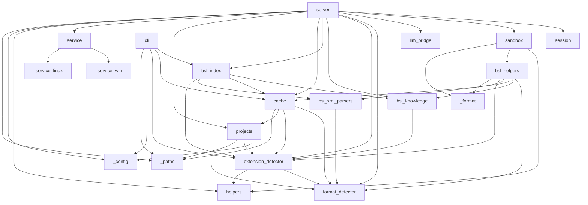

# Карта модулей

## Группы модулей

### Точки входа
- **`__init__.py`** — пакет, публичный API (`__version__`)
- **`__main__.py`** — `python -m rlm_tools_bsl` → запуск MCP-сервера
- **`cli.py`** — CLI `rlm-bsl-index` (build / update / info / drop) → `bsl_index`, `cache`, `extension_detector`, `_config`, `_paths`
- **`server.py`** — MCP-сервер (5 тулов: rlm_projects, rlm_index, rlm_start, rlm_execute, rlm_end) → `session`, `sandbox`, `llm_bridge`, `format_detector`, `extension_detector`, `bsl_knowledge`, `bsl_index`, `cache`, `projects`, `service`, `helpers`, `_config`, `_paths`

### Сессии и песочница
- **`session.py`** — SessionManager, двухуровневый TTL (idle/active), `build_session_manager_from_env()` → _(нет внутренних зависимостей)_
- **`sandbox.py`** — Sandbox (exec Python в изолированном окружении с хелперами); session-wide anti-duplicate detection в `_wrap_helpers` (v1.10.0); сообщения-подсказки `_add_error_hints` для типичных ошибок (KeyError на контракте `get_object_full_structure`, FileNotFoundError для parse_object_xml/read_procedure, TimeoutError, NameError, restricted import) → `helpers`, `bsl_helpers`, `_format`

### BSL-логика
- **`bsl_helpers.py`** — 45 хелпер-функций для анализа BSL/1С (регистрируются через `_reg()`). Из v1.10.0: агрегатор `get_object_full_structure(name)` (1 вызов вместо 3-5 — заменяет parse_object_xml + find_attributes + find_predefined + find_enum_values; `_meta.index_used`/`fallback_reason`/`ts_synonyms_available`); `find_call_hierarchy(name, direction='callers', depth=1..3)` — multi-level callers tree через `idx_calls_callee`; `find_register_movements` отдаёт `is_postable: False` + hint при `Posting=Deny`; `find_event_subscriptions` поддерживает `event_filter` (list[str] или строка — нормализуется) и `limit` (paginated dict); `find_based_on_documents` lazy back_scan через ObjectModule других Documents (v1.10.0); `analyze_document_flow` обогащён `based_on`/`print_forms` + top-level `is_postable`/`hint`; `_resolve_object_xml` нормализует «фейковые» .mdo/.xml пути. Из v1.9.0: `find_references_to_object`, `find_defined_types`. → `format_detector`, `bsl_knowledge`, `cache`, `bsl_xml_parsers`, `extension_detector`, `_format`
- **`bsl_knowledge.py`** — стратегия анализа, **12 бизнес-рецептов** (себестоимость, проведение, распределение, печать, права, интеграция, события формы, ссылки, тип реквизита, **перечисления, ввод на основании, структура объекта** — последние три из v1.10.0); 44 алиаса; **DISAMBIGUATION-секция** (9 пар: `get_object_full_structure` vs `analyze_object`, `find_call_hierarchy` vs `find_callers_context`, `find_callers` vs `find_callers_context`, `find_register_movements` vs `analyze_document_flow`, `parse_object_xml` vs `find_attributes`, ключи `get_object_full_structure` vs `find_attributes`, путь `parse_object_xml` к директории, `parse_object_xml` для Roles vs `find_roles`, `find_event_subscriptions` event_filter list[str], `find_based_on_documents` back_scan); WORKFLOW, INDEX TIPS, Step 4 ANALYZE INSTANT/HYBRID/LIVE → `extension_detector`
- **`bsl_index.py`** — SQLite-индекс v12 (26 таблиц + FTS5: core×4, metadata×17, navigation×1, references×4 — `metadata_references`, `exchange_plan_content`, `defined_types`, `characteristic_types`), IndexBuilder, IndexReader, **git fast path с pointwise incremental refresh** (v1.9.3: per-object DELETE+INSERT для Catalogs/Documents/IRегистры/AРегистры/АOрегистры/CoA/EventSubscriptions/ScheduledJobs/XDTOPackages вместо category-wide rescan; soft thresholds + bulk fallback для остального); защита от битых XML в `parse_metadata_xml` (try/except в 3 callsites, v1.10.0 BUG-3); `IndexReader.get_event_subscriptions(event_filter=...)` нормализует строку в `[строка]` (v1.10.0 BUG-8). BUILDER_VERSION=12 (без изменений с v1.9.x) → `bsl_knowledge`, `cache`, `format_detector`, `bsl_xml_parsers`, `extension_detector`
- **`bsl_xml_parsers.py`** — парсеры XML-метаданных 1С (CF и EDT форматы): `parse_metadata_xml` (с полем `references` для reverse-index), `canonicalize_type_ref`, `parse_defined_type`, `parse_pvh_characteristics`, `parse_command_parameter_type`, `parse_event_subscription_xml`, `parse_scheduled_job_xml`, `parse_xdto_package_xml` → `format_detector`

### Детектирование формата
- **`format_detector.py`** — определение CF/EDT, парсинг путей BSL-файлов (`parse_bsl_path`, `METADATA_CATEGORIES`) → _(нет внутренних зависимостей)_
- **`extension_detector.py`** — обнаружение расширений 1С и переопределений методов → `format_detector`, `helpers`

### Инфраструктура
- **`helpers.py`** — общие утилиты (smart_truncate, normalize_path, format_table) → _(нет внутренних зависимостей)_
- **`cache.py`** — дисковый кеш BSL-файлов (root зависит от `RLM_INDEX_DIR`/`RLM_CONFIG_FILE`/`~/.cache`, см. `docs/INDEXING.md`) → `format_detector`, `extension_detector`, `projects`, `_paths`
- **`llm_bridge.py`** — OpenAI-совместимый LLM-клиент (батчинг, retry) → _(нет внутренних зависимостей)_
- **`projects.py`** — реестр проектов (name → path, `projects.json`) → `_config`, `extension_detector`, `_paths`
- **`_config.py`** — загрузка конфигурации, поиск `.env` и `service.json` → _(нет внутренних зависимостей)_
- **`_format.py`** — форматирование вывода (presentation layer) → _(нет внутренних зависимостей)_
- **`_paths.py`** — общая каноникализация файловых путей (используется `server.py`, `projects.py`, `cache.py`, `cli.py`) → _(нет внутренних зависимостей)_

### Сервис
- **`service.py`** — управление сервисом (install / start / stop / status) → `_service_win` (Windows), `_service_linux` (Linux)
- **`_service_win.py`** — реализация Windows-сервиса через pywin32 → `service`
- **`_service_linux.py`** — реализация Linux systemd `--user` юнита → `service`

## Граф зависимостей

